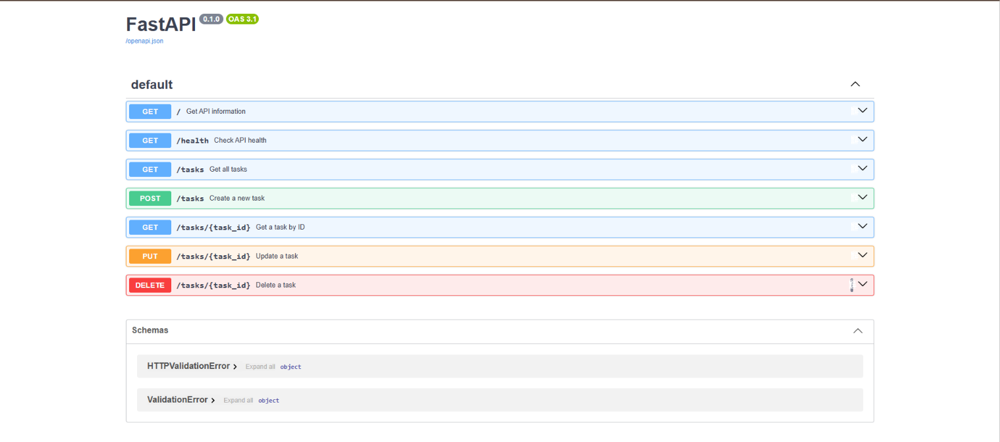

# FlyRank Backend Internship — A1 Task API

A simple CRUD REST API built using **Python and FastAPI** as part of the FlyRank Backend Internship.

The project implements an in-memory Task API with validation, proper HTTP status codes, Swagger documentation, and basic error handling.

## Features

- FastAPI REST API
- In-memory task storage
- Create, read, update, and delete tasks
- Input validation
- JSON error responses
- Proper HTTP status codes
- Interactive Swagger UI documentation
- Tested using `curl`

## Requirements

- Python 3.10+
- FastAPI
- Uvicorn

## Installation

Clone the repository and navigate to the A1 folder:

```bash
cd A1_Task_API
```

Create and activate a virtual environment:

### Windows

```powershell
python -m venv .venv
.venv\Scripts\activate
```

Install the dependencies:

```bash
pip install -r requirements.txt
```

## Running the API

Start the FastAPI server using:

```bash
uvicorn main:app --reload
```

The API will be available at:

```text
http://127.0.0.1:8000
```

## API Endpoints

| Method | Endpoint | Description |
|---|---|---|
| GET | `/` | Get API information |
| GET | `/health` | Check API health |
| GET | `/tasks` | Get all tasks |
| GET | `/tasks/{task_id}` | Get a task by ID |
| POST | `/tasks` | Create a new task |
| PUT | `/tasks/{task_id}` | Update a task |
| DELETE | `/tasks/{task_id}` | Delete a task |

## Example Task

```json
{
    "id": 1,
    "title": "Learn FastAPI",
    "done": false
}
```

The API starts with three example tasks:

```json
[
    {
        "id": 1,
        "title": "Learn FastAPI",
        "done": false
    },
    {
        "id": 2,
        "title": "Build Task API",
        "done": false
    },
    {
        "id": 3,
        "title": "Push project to GitHub",
        "done": false
    }
]
```

## Error Handling

The API returns appropriate HTTP status codes and JSON error messages.

### Task Not Found

```text
404 Not Found
```

```json
{
    "error": "Task 99 not found"
}
```

### Empty or Missing Title

```text
400 Bad Request
```

```json
{
    "error": "Title cannot be empty"
}
```

### Empty Update Request

```text
400 Bad Request
```

```json
{
    "error": "Request body cannot be empty"
}
```

### Invalid `done` Value

The `done` field must be a boolean.

```json
{
    "error": "Done must be a boolean"
}
```

## Example curl Request

Get all tasks:

```bash
curl.exe -i http://127.0.0.1:8000/tasks
```

Example output:

```text
HTTP/1.1 200 OK
date: Tue, 08 Sep 2026 18:16:42 GMT
server: uvicorn
content-length: 149
content-type: application/json

[{"id":1,"title":"Learn FastAPI","done":false},{"id":2,"title":"Build Task API","done":false},{"id":3,"title":"Push project to GitHub","done":false}]
```

## Swagger UI

FastAPI automatically provides interactive API documentation through Swagger UI.

Open:

```text
http://127.0.0.1:8000/docs
```

The Swagger UI allows the available API endpoints to be viewed and tested directly from the browser.

### Swagger Screenshot



## Project Structure

```text
FlyRank-Backend-Internship/
├── A1_Task_API/
│   ├── main.py
│   ├── README.md
│   ├── requirements.txt
│   └── swagger.png
│
├── .gitignore
└── .venv/          # Local virtual environment, ignored by Git
```

## Implementation

The API uses an in-memory Python list to store tasks.

Each task contains:

- `id` — Unique task ID
- `title` — Task title
- `done` — Completion status

Because the data is stored in memory, tasks are reset whenever the application is restarted.

## HTTP Status Codes

| Status Code | Usage |
|---|---|
| `200 OK` | Successful GET/PUT request |
| `201 Created` | Task successfully created |
| `204 No Content` | Task successfully deleted |
| `400 Bad Request` | Invalid request data |
| `404 Not Found` | Requested task does not exist |

## Git Commit History

The project was developed using meaningful Git commits:

1. `chore: initialize repository`
2. `feat: add hello FastAPI server`
3. `feat: add root and health endpoints`
4. `feat: add task read endpoints`
5. `feat: add task creation with validation`
6. `feat: add full task CRUD`
7. `docs: improve Swagger endpoint descriptions`
8. `docs: finalize project documentation`
9. `chore: organize A1 into assignment folder`
10. `docs: update A1 project structure`

## Conclusion

This project demonstrates the implementation of a basic CRUD REST API using FastAPI, including routing, request handling, validation, error handling, HTTP status codes, Swagger documentation, and Git-based project management.