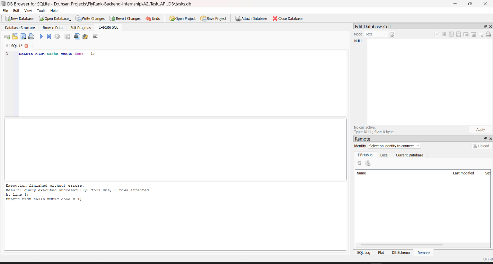

# FlyRank Backend Internship — A2 Task API with SQLite

A CRUD REST API built using **Python, FastAPI, and SQLite** as part of the FlyRank Backend Internship.

This project is the continuation of A1. The API behavior remains the same, but the task data is now stored in a SQLite database instead of an in-memory Python list.

## Features

- FastAPI REST API
- SQLite database storage
- Automatic database creation
- Automatic table creation
- Three seed tasks on an empty database
- Create, read, update, and delete tasks
- Input validation
- Parameterized SQL queries
- JSON error responses
- Proper HTTP status codes
- Data persistence across server restarts
- SQLite database explored using DB Browser for SQLite
- Tested using PowerShell and `curl`

## Technologies Used

- Python
- FastAPI
- Uvicorn
- SQLite
- Python `sqlite3` module
- DB Browser for SQLite

The Python `sqlite3` module is built into Python, so no separate SQLite package is required.

## Why SQLite?

SQLite was used because it is simple and suitable for a small backend project.

- The database is stored in a single file.
- It requires zero server setup.
- It is easy to inspect using DB Browser for SQLite.
- Data survives application restarts.
- It is suitable for small applications and development projects.

## Project Structure

```text
FlyRank-Backend-Internship/
├── A1_Task_API/
│   ├── README.md
│   ├── main.py
│   ├── requirements.txt
│   └── swagger.png
│
├── A2_Task_API_DB/
│   ├── README.md
│   ├── main.py
│   ├── requirements.txt
│   └── db-browser.png
│
├── .gitignore
└── .venv/          # Local virtual environment, ignored by Git
```

The SQLite database file `tasks.db` is created automatically inside `A2_Task_API_DB/`.

The database file is ignored by Git so that each clone can create its own fresh database.

## Database Structure

The project uses a SQLite database named:

```text
tasks.db
```

The database contains a table named:

```text
tasks
```

The table has the following columns:

| Column | Type | Description |
|---|---|---|
| `id` | INTEGER | Primary key and unique task ID |
| `title` | TEXT | Task title |
| `done` | INTEGER | Completion status stored as `0` or `1` |

The table is created automatically when the application starts.

```sql
CREATE TABLE IF NOT EXISTS tasks (
    id INTEGER PRIMARY KEY,
    title TEXT NOT NULL,
    done INTEGER NOT NULL DEFAULT 0
);
```

## Automatic Seed Data

When the `tasks` table is empty, the application inserts three example tasks:

```text
1. Learn FastAPI
2. Connect FastAPI to SQLite
3. Test database persistence
```

The seed data is inserted only when the table contains no tasks.

This prevents duplicate seed data when the application is restarted.

## Installation

Navigate to the A2 folder:

```bash
cd A2_Task_API_DB
```

Create and activate a virtual environment if needed:

### Windows

```powershell
python -m venv .venv
.venv\Scripts\activate
```

Install the project dependencies:

```powershell
pip install -r requirements.txt
```

## Running the API

Start the FastAPI application using:

```powershell
uvicorn main:app --reload
```

The API will be available at:

```text
http://127.0.0.1:8000
```

## API Endpoints

| Method | Endpoint | Description |
|---|---|---|
| GET | `/` | Get API information |
| GET | `/health` | Check API health |
| GET | `/tasks` | Get all tasks |
| GET | `/tasks/{task_id}` | Get a task by ID |
| POST | `/tasks` | Create a new task |
| PUT | `/tasks/{task_id}` | Update a task |
| DELETE | `/tasks/{task_id}` | Delete a task |

## GET All Tasks

Request:

```text
GET /tasks
```

Example:

```powershell
curl.exe http://127.0.0.1:8000/tasks
```

Example response:

```json
[
    {
        "id": 1,
        "title": "Learn FastAPI",
        "done": 0
    },
    {
        "id": 2,
        "title": "Connect FastAPI to SQLite",
        "done": 0
    },
    {
        "id": 3,
        "title": "Test database persistence",
        "done": 0
    }
]
```

## GET Task by ID

Request:

```text
GET /tasks/{task_id}
```

Example:

```powershell
curl.exe http://127.0.0.1:8000/tasks/1
```

Example response:

```json
{
    "id": 1,
    "title": "Learn FastAPI",
    "done": 0
}
```

If the task does not exist:

```json
{
    "error": "Task not found"
}
```

The API returns:

```text
404 Not Found
```

## Create a Task

Request:

```text
POST /tasks
```

Example PowerShell request:

```powershell
Invoke-RestMethod -Uri "http://127.0.0.1:8000/tasks" -Method POST -ContentType "application/json" -Body '{"title":"Learn SQLite"}'
```

Example response:

```json
{
    "id": 4,
    "title": "Learn SQLite",
    "done": 0
}
```

A successful creation returns:

```text
201 Created
```

The task is inserted into SQLite using a parameterized query:

```sql
INSERT INTO tasks (title, done) VALUES (?, ?);
```

## Update a Task

Request:

```text
PUT /tasks/{task_id}
```

Example:

```powershell
Invoke-RestMethod -Uri "http://127.0.0.1:8000/tasks/4" -Method PUT -ContentType "application/json" -Body '{"title":"Learn SQLite and SQL","done":true}'
```

The update uses a parameterized SQL query:

```sql
UPDATE tasks SET title = ?, done = ? WHERE id = ?;
```

## Delete a Task

Request:

```text
DELETE /tasks/{task_id}
```

Example:

```powershell
curl.exe -i -X DELETE http://127.0.0.1:8000/tasks/4
```

A successful deletion returns:

```text
204 No Content
```

The delete operation uses:

```sql
DELETE FROM tasks WHERE id = ?;
```

## Validation and Error Handling

The API validates task input and returns JSON error messages.

### Empty or Missing Title

```text
400 Bad Request
```

```json
{
    "error": "Title cannot be empty"
}
```

### Empty Update Request

```text
400 Bad Request
```

```json
{
    "error": "Request body cannot be empty"
}
```

### Invalid `done` Value

The `done` field must be a boolean.

```json
{
    "error": "Done must be a boolean"
}
```

### Task Not Found

```text
404 Not Found
```

```json
{
    "error": "Task not found"
}
```

## Parameterized SQL Queries

Database operations use parameterized SQL queries instead of directly inserting user input into SQL statements.

Examples:

```sql
SELECT * FROM tasks WHERE id = ?;
```

```sql
INSERT INTO tasks (title, done) VALUES (?, ?);
```

```sql
UPDATE tasks SET title = ?, done = ? WHERE id = ?;
```

```sql
DELETE FROM tasks WHERE id = ?;
```

This keeps user-provided values separate from the SQL query itself.

## Persistence

Unlike A1, where tasks were stored in an in-memory Python list, A2 stores tasks in `tasks.db`.

This means:

```text
API request
     ↓
FastAPI
     ↓
SQLite database
     ↓
tasks.db
```

Tasks remain available after restarting the FastAPI server.

For example, a task created through the API remained available after stopping and starting the server again.

## DB Browser for SQLite

The SQLite database was opened and explored using **DB Browser for SQLite**.

The database contains the `tasks` table:



## SQL Queries Explored

The following SQL queries were executed manually in DB Browser for SQLite.

### View all tasks

```sql
SELECT * FROM tasks;
```

This query displays all rows stored in the `tasks` table.

### Find completed tasks

```sql
SELECT * FROM tasks WHERE done = 1;
```

This query returns tasks whose completion status is `1`.

### Count tasks

```sql
SELECT COUNT(*) FROM tasks;
```

The query returned `3`, confirming that three tasks were stored in the database at that point.

### Mark all tasks as completed

```sql
UPDATE tasks SET done = 1;
```

This updated all three tasks so that their `done` value became `1`.

### Delete completed tasks

```sql
DELETE FROM tasks WHERE done = 1;
```

This removed the completed tasks from the database.

After making the changes directly in DB Browser, the API reflected the database state immediately without restarting FastAPI.

## HTTP Status Codes

| Status Code | Usage |
|---|---|
| `200 OK` | Successful GET/PUT request |
| `201 Created` | Task successfully created |
| `204 No Content` | Task successfully deleted |
| `400 Bad Request` | Invalid request data |
| `404 Not Found` | Requested task does not exist |

## A1 to A2

A2 is a direct continuation of A1.

| A1 | A2 |
|---|---|
| In-memory Python list | SQLite database |
| Data lost on restart | Data persists after restart |
| No database | `tasks.db` |
| Python list operations | SQL queries |
| No persistent storage | Persistent storage |

The API endpoints and general CRUD behavior remain consistent while the storage layer has been changed from memory to SQLite.

## Git Commit History

The project was developed using stage-based Git commits:

1. `Stage 0: create SQLite database`
2. `Stage 1: database read endpoints`
3. `Stage 2: insert into database`
4. `Stage 3: update and delete with SQL`

Stage 4 contains the manual SQLite exploration and database documentation.

## Conclusion

A2 successfully connects the FastAPI CRUD API to SQLite.

The project demonstrates:

- SQLite database creation
- Automatic table creation
- Seed data initialization
- CRUD operations using SQL
- Parameterized queries
- Input validation
- Error handling
- Data persistence
- Database inspection using DB Browser for SQLite

The API now stores task data persistently instead of relying on an in-memory Python list.
