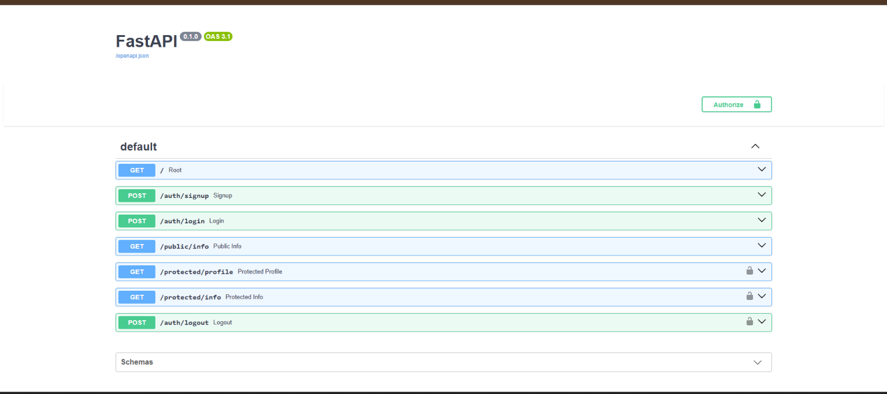

# FlyRank Auth API

A FastAPI authentication API built using **Supabase Auth**. This project implements user signup, login, Bearer-token authentication, protected routes, token verification, logout, and Swagger authentication.

## Features

- User signup
- User login
- Supabase access and refresh tokens
- Public API endpoint
- Protected API endpoints
- Bearer token authentication
- Supabase access-token verification
- Reusable FastAPI authentication dependency
- Logout
- Swagger UI authentication with the **Authorize** button
- Environment-based configuration

## Tech Stack

- Python
- FastAPI
- Supabase Auth
- Supabase Python SDK
- python-dotenv
- Uvicorn

## Project Structure

```text
A4_Task_API_Auth/
├── .env
├── .env.example
├── .gitignore
├── main.py
├── README.md
├── requirements.txt
└── swagger.png
```

## Setup

### 1. Create and activate the virtual environment

From the repository root:

```powershell
python -m venv .venv
```

Activate it on Windows PowerShell:

```powershell
.\.venv\Scripts\Activate.ps1
```

### 2. Install dependencies

```powershell
python -m pip install -r A4_Task_API_Auth\requirements.txt
```

### 3. Configure environment variables

Create a `.env` file inside `A4_Task_API_Auth`:

```env
SUPABASE_URL=your_project_url
SUPABASE_KEY=your_anon_or_publishable_key
PORT=3000
```

Use the Supabase project URL and publishable/anon key from your Supabase project.

**Do not commit `.env` or expose your Supabase credentials.**

The repository includes `.env.example` as a template.

## Run the API

From the `A4_Task_API_Auth` directory:

```powershell
python -m uvicorn main:app --reload --port 3000
```

The API will be available at:

```text
http://127.0.0.1:3000
```

Swagger documentation:

```text
http://127.0.0.1:3000/docs
```

## API Endpoints

| Method | Endpoint | Authentication | Description |
|---|---|---|---|
| GET | `/` | Public | API information |
| POST | `/auth/signup` | Public | Create a new user |
| POST | `/auth/login` | Public | Login and receive tokens |
| GET | `/public/info` | Public | Public information |
| GET | `/protected/profile` | Bearer token | Get authenticated user's profile |
| GET | `/protected/info` | Bearer token | Protected information |
| POST | `/auth/logout` | Bearer token | Logout |

## Authentication Flow

### Signup

Send:

```json
{
  "email": "user@example.com",
  "password": "password"
}
```

to:

```text
POST /auth/signup
```

Successful signup returns HTTP `201`.

### Login

Send the same credentials to:

```text
POST /auth/login
```

A successful login returns:

```json
{
  "access_token": "...",
  "refresh_token": "..."
}
```

### Protected Routes

Protected endpoints require:

```text
Authorization: Bearer <access_token>
```

The API verifies the access token with Supabase before returning protected data.

Invalid or expired tokens return HTTP `401`:

```json
{
  "detail": "Invalid or expired token"
}
```

### Logout

Send:

```text
POST /auth/logout
```

with a valid Bearer token.

A successful logout returns HTTP `204 No Content`.

## Swagger Authentication

The API uses FastAPI's HTTP Bearer security scheme.

In Swagger:

1. Open `/docs`.
2. Click **Authorize**.
3. Enter the access token.
4. Click **Authorize**.
5. Protected endpoints can then be executed directly from Swagger.



## Error Responses

### Missing authentication

Protected endpoints return HTTP `401` when an access token is not provided.

### Invalid authentication

Invalid or expired tokens return HTTP `401`:

```json
{
  "detail": "Invalid or expired token"
}
```

### Invalid login

Invalid login credentials return HTTP `401`:

```json
{
  "error": "Invalid login credentials"
}
```

## Security

- Supabase credentials are stored in `.env`.
- `.env` is excluded from Git.
- `.env.example` contains placeholders only.
- Access tokens are verified through Supabase Auth.
- Protected endpoints require Bearer authentication.

## Testing

The API was tested for:

- Signup → `201 Created`
- Login → `200 OK`
- Public endpoint → `200 OK`
- Protected endpoint without token → `401 Unauthorized`
- Protected endpoint with valid token → `200 OK`
- Invalid/fake token → `401 Unauthorized`
- Logout → `204 No Content`
- Swagger Bearer authentication

## GitHub

Repository:

https://github.com/Ihsankp-2006/FlyRank-Backend-Internship

A4 project:

```text
A4_Task_API_Auth
```
